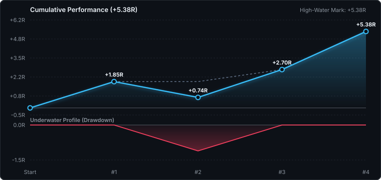

# Verified Trade Ledger (Unitized R)

> [!NOTE]
> All performance is unitized in **R-multiples** (risk units per trade) net of modeled taker fees and funding drag. Dollar sizing, margin, and account balances are strictly omitted.

## Performance Tear-Sheet

```text
┌─────────────────────────┬─────────────────────────┬─────────────────────────┐
│     EDGE & EXPECTANCY   │    CAPITAL PROTECTION   │    EXECUTION EFFICIENCY │
├─────────────────────────┼─────────────────────────┼─────────────────────────┤
│ Net Return:      +5.38R  │ Max Drawdown:     -1.11R │ Profit Factor:     5.85 │
│ Expectancy:   +1.35R/trd │ Recovery Factor:    4.85 │ Payoff Ratio:     1.95x │
│ Win Rate:         75.0%  │ Max Consec Loss:      1 │ Cost Drag:        12.2% │
│ Avg Win:         +2.16R  │ Max Consec Win:       2 │ Avg Win Hold:     20.7h │
│ Avg Loss:        -1.11R  │ SQN Score:          1.60 │ Avg Loss Hold:     3.8h │
└─────────────────────────┴─────────────────────────┴─────────────────────────┘
```

## Cumulative Performance & Drawdown Profile



---

## The Book

```text
#1 ▲ ETH · TP2 · R:R 1.85
#2 ▼ ETH · SL · R:R -1.11
#3 ▼ ETH · TP1 + BE · R:R 1.96 · liq-sweep-reject
#4 ▼ ETH · TP2 · R:R 2.68 · fade-the-move
#5 ▼ ETH · open · fade-contd-healthy-retracement
   └ entry 2,684.50 · sl 2,719.50 · tp1 2,616.00 · tp2 2,563.00
```

---

## Setup Attribution (Alpha Decomposition)

| Setup Tag | Trades | Win Rate | Net Return | Expectancy | Avg Hold | Gate Status |
| :--- | :-: | :-: | -: | -: | -: | :--- |
| `untagged` | 2 | 50.0% | +0.74R | +0.37R | 9.0h | Incubating (n=2/30) |
| `liq-sweep-reject` | 1 | 100.0% | +1.96R | +1.96R | 14.3h | Incubating (n=1/30) |
| `fade-the-move` | 1 | 100.0% | +2.68R | +2.68R | 33.5h | Incubating (n=1/30) |

---

## Chronological Trade Ledger

| # | Date (UTC) | Dir | Symbol | Setup | Entry | Stop | TP1 | TP2 | Exit | Result | Hold | Realized R | Cum R |
| :- | :- | :-: | :- | :- | -: | -: | -: | -: | -: | :-: | -: | -: | -: |
| **1** | 2026-09-17 23:25 | ▲ | ETH | `untagged` | 2,400.00 | 2,363.00 | 2,460.00 | 2,522.00 | 2,522.00 | TP2 | 14.2h | **+1.85R** | **+1.85R** |
| **2** | 2026-09-17 23:26 | ▼ | ETH | `untagged` | 2,448.25 | 2,480.00 | 2,420.00 | 2,380.00 | 2,480.00 | SL | 3.8h | **-1.11R** | **+0.74R** |
| **3** | 2026-09-20 02:20 | ▼ | ETH | `liq-sweep-reject` | 2,635.42 | 2,659.50 | 2,571.68 | 2,507.93 | 2,635.42 | TP1 + BE | 14.3h | **+1.96R** | **+2.70R** |
| **4** | 2026-09-22 06:42 | ▼ | ETH | `fade-the-move` | 2,774.29 | 2,810.00 | 2,707.19 | 2,640.08 | 2,640.08 | TP2 | 33.5h | **+2.68R** | **+5.38R** |
| **5** | 2026-09-23 23:57 | ▼ | ETH | `fade-contd-healthy-retracement` | 2,684.50 | 2,719.50 | 2,616.00 | 2,563.00 | *open* | *active* | *holding* | *open* | — |
